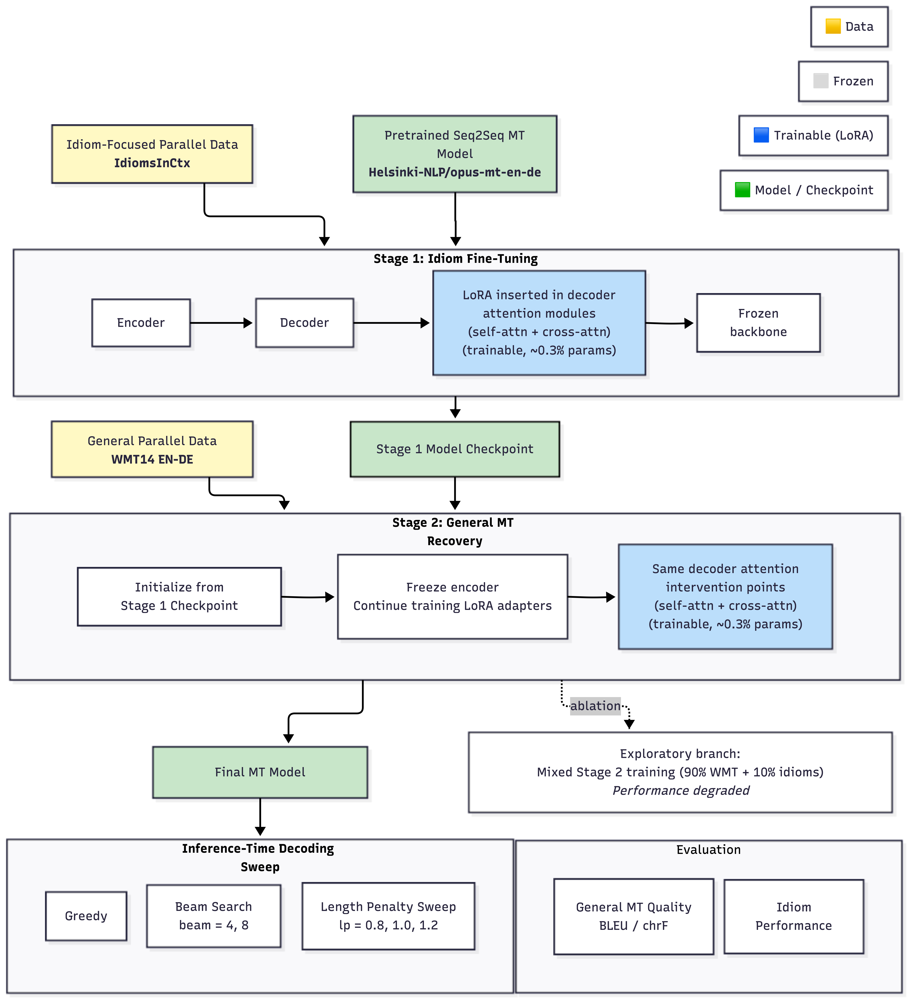
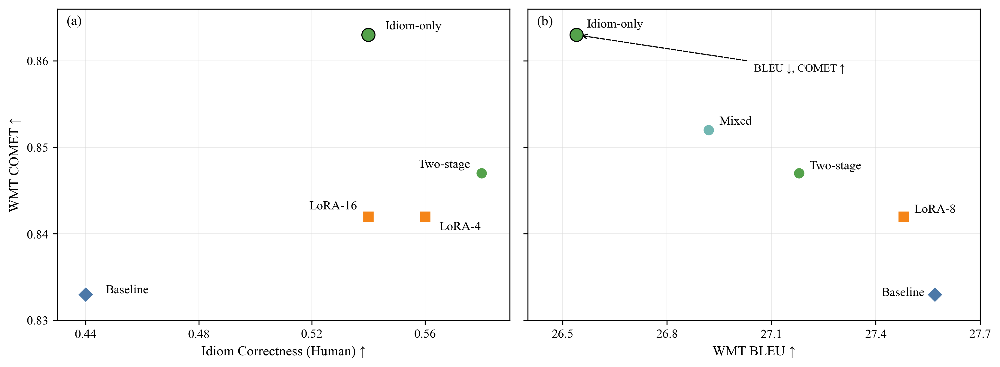

# 🧠 Idiom-Aware Machine Translation (EN → DE)
### Mitigating Catastrophic Forgetting in EN-DE Idiom Translation via Two-Stage Fine-Tuning and Metric-Aware Evaluation

> **TL;DR**  
> Built a novel training pipeline that improves idiom translation by **+14pp (human eval)** without degrading general translation quality — and showed that standard metrics (BLEU) can be misleading compared to semantic metrics (COMET).

---

## 💡 Why This Project Matters

Modern machine translation systems are highly fluent — but often fail on **idiomatic expressions** like:

> “kick the bucket” → ❌ literal translation → incorrect meaning

This project tackles a key challenge in NLP:

👉 **How do we improve specialized capabilities (idioms) without breaking general performance?**

---

## 🏗️ Method Overview

We introduce a **two-stage fine-tuning approach**:

- **Stage 1:** Fine-tune on idiom-heavy data (learn non-compositional mappings)  
- **Stage 2:** Re-align with general-domain data (restore overall translation quality)

Variants explored:
- Encoder freezing
- Mixed-data training (WMT + idioms)
- Parameter-efficient fine-tuning (LoRA)
- Few-shot Prompt-tuning

---

## 📊 Results (High-Level)

### 🎯 Idiom Performance
- **+14 percentage point improvement** in idiom correctness (human evaluation)

### ⚖️ Metric-Dependent Findings
| Metric | Conclusion |
|--------|------------|
| BLEU   | Suggests degradation |
| COMET  | Shows improvement |
| Human Eval | Confirms COMET |

👉 **Key Insight:**  
> Catastrophic forgetting is not absolute — it depends on how you measure it.

---

## 🔍 Key Findings

- Idiom-only fine-tuning improves semantic quality (COMET) but reduces lexical overlap (BLEU), highlighting metric-dependent conclusions.
- Two-stage fine-tuning achieves the best **trade-off**
- BLEU and COMET can give **opposite conclusions**
- Prompt-based methods fail on idioms (~0.02 correctness)
- LoRA achieves competitive results with **~0.3% parameters**

| Model        | BLEU (Idioms) | chrF (Idioms) | COMET (Idioms) | BLEU (WMT) | chrF (WMT) | COMET (WMT) |
|--------------|--------------|--------------|----------------|------------|------------|-------------|
| Baseline     | 39.65        | 60.79        | 0.733          | **27.57**  | 58.43      | 0.833       |
| Idiom-only   | **44.16**    | **64.44**    | **0.763**      | 26.54      | 58.23      | **0.863**   |
| Two-stage    | 43.16        | 63.34        | 0.761          | 27.18      | 58.34      | 0.847       |
| Mixed-data   | 43.49        | 62.92        | 0.741          | 26.92      | 58.10      | 0.852       |
| LoRA-8       | 42.18        | 61.76        | 0.732          | 27.48      | **58.46**  | 0.842       |
|--------------|--------------|--------------|----------------|------------|------------|-------------|
| Prompt (0-shot) | 8.12     | 33.14        | 0.381          | 7.62       | 35.54      | 0.474       |

---

## 📈 Visual Insights

### Trade-Off: Specialization vs Generalization

- Two-stage FT lies on the **Pareto frontier**
- Balances idiom correctness and general performance

### Metric Disagreement (BLEU vs COMET)

- Idiom-only model: BLEU ↓ but COMET ↑
- Demonstrates **metric-dependent conclusions**

---

## 🧪 Technical Stack

- PyTorch
- HuggingFace Transformers
- COMET (semantic evaluation)
- Custom evaluation pipeline
- Human annotation workflow

---

## 📁 Project Structure

├── config/                       # Config to run on M4 Apple Silicone
├── notebooks/                    # Experiments
├── qual_preds/                   # DE Sentence Predictions
├── report/                       # Paper
├── results/                      # Metrics & analysis
    ├── automatic_eval_outputs/   # BLEU, chrF, COMET
    ├── human_eval_outputs/       # Human annotation eval of 25 idiom + 25 WMT sentence predictions
    ├── prompting/                # Sentence predictions of Prompt-tuning models (*not OPUS)
├── figures/                      # Plots and diagrams
└── README.md
